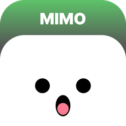

<p align="center">
  
</p>

# Mimo

Mimo is a desktop companion for Windows that lives in a small floating pill at the top of the screen, inspired by the iOS Dynamic Island. It is designed to analyze what is happening on the computer and surface suggestions or automate small tasks for the user.

The project is in early development. Mimo already understands typed and spoken requests (French and English), learns from your activity and makes its first suggestions.

## Features

- **Floating pill** - borderless window at the top-center of the screen, responsive to screen size/DPI, auto-hides when idle, with a system tray icon and a right-click quick menu
- **Summon** - global shortcut (`F9` by default, configurable) for a typed request, or say "Hey Mimo" for a spoken one
- **Offline voice recognition** - [Vosk](https://alphacephei.com/vosk/) runs entirely on the machine; only the model for the selected language is loaded
- **Open apps and sites** - installed Start menu apps (desktop and Store), common websites and built-in Windows programs, by name ("open spotify", "ouvre youtube")
- **Quick answers** - time, date and weather (for your area or a named city)
- **PC check-up** - CPU, memory, disk, temperature, battery and GPU readings with plain-language advice, shown in a dedicated panel
- **Notifications** - lists recent Windows notifications, and reads them aloud when asked by voice
- **Reminders and alarms** - "remind me in 10 minutes to...", "set an alarm for 7:30"
- **Tasks** - a simple to-do list with optional days and times, managed by voice or text
- **Translation** - translate typed text, or whatever you copy next, between French and English
- **Activity insights** - learns which apps you use and when (stored only on your PC, 30 days); ask for your screen time or a summary of your day
- **Suggestions** - offers on its own to open the apps you usually start around this time, to close an app that's slowing the PC down, to take a break or to go to bed - never over a fullscreen game or video, never stealing focus
- **Settings** - language (English / French), launch at Windows startup, summon shortcut, "Hey Mimo" on/off, activity analysis and suggestions on/off (separately), sounds, erase all local data

## Privacy

Mimo has no telemetry and keeps its data (settings, reminders, tasks, activity history) on the PC. Voice recognition is fully offline. The only network requests are:

- opening the URLs you ask for
- weather: [Open-Meteo](https://open-meteo.com/) for the forecast and city lookup, and [ipwho.is](https://ipwho.is/) to approximate your location from your IP when no city is given
- translation: the text to translate is sent to Google Translate

## Architecture

The project is a Cargo workspace, split so the core logic stays independent of the UI:

- `crates/core` (`mimo-core`) - engine, settings and all the logic: request parsing (FR/EN), app matching, reminders, tasks, check-up advice. No Tauri dependency, unit-testable on its own.
- `crates/commands` (`mimo-commands`) - thin bridge exposing `mimo-core` to the frontend as Tauri commands.
- `apps/desktop` - the Tauri shell: Svelte/TypeScript frontend (pill, tray menu, panel), window management, and OS integration (voice, sounds, installed apps, notifications, system readings, persistence).

This separation means the core engine can evolve, be tested, and eventually be reused without being coupled to how the UI is built.

## Tech stack

- [Tauri 2](https://tauri.app/) (Rust) for the native shell - small footprint compared to an Electron-based app
- Svelte 5 + SvelteKit (static/SPA mode) + TypeScript for the frontend
- Windows only for now; cross-platform support is not a current goal

## Development

Requirements: Rust (stable), Node.js, npm.

```bash
cd apps/desktop
npm install
npm run tauri dev
```

`npm run tauri dev` first runs `npm run setup:voice`, which downloads the Vosk runtime and the French/English models into `src-tauri/resources/vosk/` (once; it is skipped when they are already there). The app still starts without them, with voice disabled.

Run the tests (from the repository root):

```bash
cargo test --workspace
```

## License

MIT, see [LICENSE](LICENSE).
